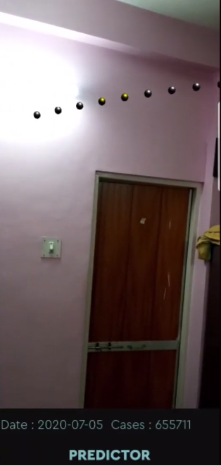
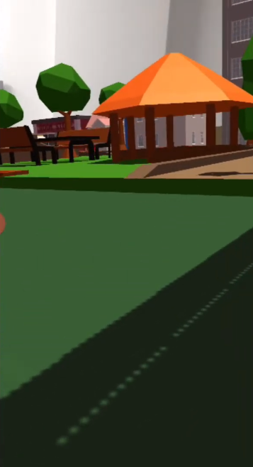

# Covitopia

Covitopia is an AR app developed in unity by the team <b>Vikings</b>, for the HackInIndia Hackathon.

## Features

- Simulator: Use simulation to understand how the COVID-19 virus spreads in community. Change  simulation parameters, modify safety precautions to understand how fast or slow the virus spreads based on conditions.
- Predictor: Predictions that tell you how many cases of COVID-19 will be present for the next two weeks, helping you take informed decisions.
- Social Distancing: Maintain social distancing at all times using the AR circles that spawn in real world to help you follow the guidelines of social distancing and hence keep you.

## Screenshots

  

   
  
  
  

App Demo can be found [here](https://youtu.be/sm-JpaAYQaM) 
